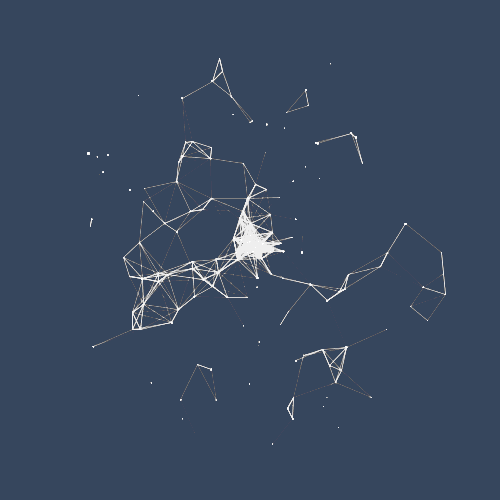
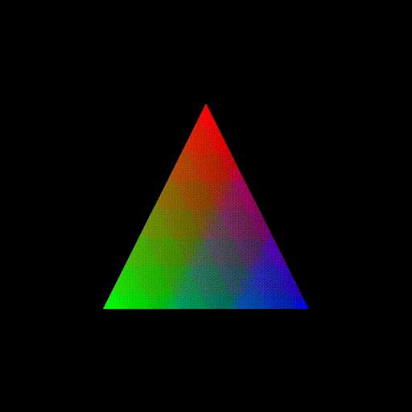
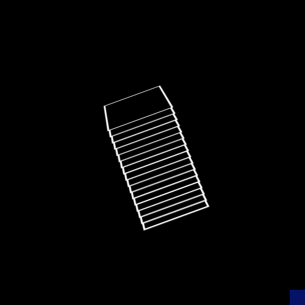
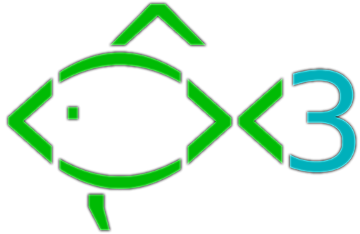

[Home](../README.md) **|** [Documentation](../docs/README.md) **|** **Images**

----

#   Images for Windows Terminal 

> *My Personal Collection of images for use with Windows Terminal*

---

## Types of Images

- **[Background Images](#animated-background-images)** - These types of images can be used as the background to the whole terminal window.
- [**Icons**](#shell-icons) - These types of images are used to bring attention to smaller elements and give more character to each selection.

---

## Animated Background Images

> **Working Directory: `images/backgrounds/animated/`**

---

*Pretty Nifty huh?*

---

###  `blue-constellations.gif`

---

### `half-circle-shuffle.gif`

 

---

### `spectrum-triangle.gif`

 

---

### `spinning-stacks.gif`

 

---

### `spinny-tube.gif`

 

---

### `white-cubes.gif`

---

## Shell Icons

> **Working Directory: `images/icons/`** 

---

### `bash.png`

---

 

### `fish.png`

---

 

### `powershell.png` 

---

### `zsh.png`

------

**🤍 2024 [Brenton Holiday](https://brenton.holiday)**