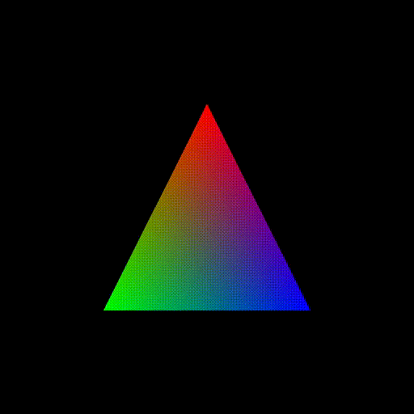
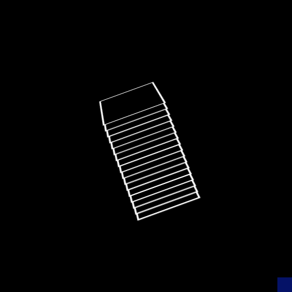

[Home](../../README.md) **|** [Documentation](../../docs/README.md) **|** **Images**

----

#  Background Images for Windows Terminal

> *My Personal Collection of images for use with Windows Terminal*

---

## Animated Background Images

> **Working Directory: `images/backgrounds/animated/`**

---

###  `blue-constellations.gif`

---

### `half-circle-shuffle.gif`

 

---

### `spectrum-triangle.gif`

 

---

### `spinning-stacks.gif`

 

---

### `spinny-tube.gif`

 

---

### `white-cubes.gif`

---

## GitHub Repository

- https://github.com/8rents/Windows-Terminal

------

**🤍 2024 [Brenton Holiday](https://brenton.holiday)**